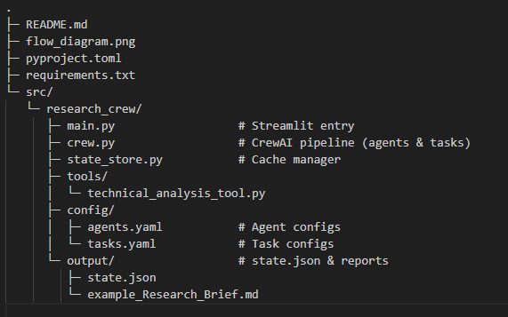

# 🔎 Research Crew

Research Crew is a multi-agent system built on **CrewAI** with a Streamlit front-end.  
It automates the pipeline of taking a **topic**, inferring the **ticker**, collecting news and data, running technical analysis, drafting a report, and synthesizing final insights.  

---

## 📊 System Flow


**Workflow**
1. **User** inputs topic via Streamlit.
2. **Ticker Collector** infers the correct symbol.
3. **Data Collector** fetches up-to-date facts and sources.
4. **Trend Analyzer** runs `technical_analysis()` on the ticker.
5. **Report Generator** compiles findings into a markdown research brief.
6. **Insight Synthesizer** distills final insights.
7. **Streamlit UI** renders report, provides download, and plots stock chart if ticker available.
8. **State store** caches results (`output/state.json`) and reports (`output/{topic}_Research_Brief.md`).

---

## 🧑‍🤝‍🧑 Agent Responsibility Matrix

| Task → / Agent ↓     | Ticker Collector | Data Collector | Trend Analyzer | Report Generator | Insight Synthesizer |
|----------------------|-----------------|----------------|----------------|------------------|---------------------|
| **Infer ticker**     | **R/A**         | C              | I              | I                | I                   |
| **Collect data**     | I               | **R/A**        | C              | C                | I                   |
| **Analyze trends**   | C               | C              | **R/A**        | I                | I                   |
| **Draft report**     | I               | C              | C              | **R/A**          | I                   |
| **Synthesize**       | C               | I              | I              | C                | **R/A**             |

**Legend**:  
- **R** = Responsible  
- **A** = Accountable  
- **C** = Consulted  
- **I** = Informed  

---

## 🔗 Communication Protocols

- **Execution model**: Sequential handoff (`Process.sequential`).
- **Message payloads**:
  - `infer_ticker` → JSON `{ "ticker": "AAPL" }`.
  - `collect_data` → Markdown with **Facts / Uncertainties / Sources**.
  - `analyze_trends` → Technical snapshot JSON (SMA, RSI, MACD, ATR, S/R, patterns).
  - `draft_report` → Full markdown research brief with YAML front-matter:  
    ```yaml
    ---
    ticker: AAPL
    ---
    ```
  - `synthesize_insights` → Bullet-point insights, risks, opportunities, next steps.
- **Caching**: All outputs are saved in `output/state.json` for reuse.
- **UI integration**: Report rendered in Streamlit, downloadable as `.md`. If ticker present, a 1-year candlestick + volume + 50/200 MAs chart is shown.

---

## 🛠️ Tool Integration & Data Flow

### Tools
- **Serper (Google Search)** – used by Data Collector for high-recency facts and citations.
- **technical_analysis()** – custom tool using `yfinance`, `ta`, `scipy`:
  - SMA(50/200), RSI, MACD
  - ATR, volatility, momentum
  - Bollinger band signals
  - Support/resistance detection
  - Naive chart pattern recognition

### Data Flow
1. **User Input** → Streamlit UI → `crew().kickoff(topic, year)`
2. **Ticker** → extracted by Ticker Collector
3. **Facts & Links** → fetched by Data Collector (via Serper)
4. **Indicators & Patterns** → returned by `technical_analysis()`
5. **Markdown Brief** → compiled by Report Generator
6. **Final Insights** → summarized by Insight Synthesizer
7. **Persistence** → state.json (cache) + Markdown report file
8. **Visualization** → Streamlit chart with OHLCV + MAs

---

## 📂 Project Layout



---

## ⚙️ Setup Instructions

### Clone the repository
```bash
git clone https://github.com/yourusername/lead-generator.git
cd lead-generator
```

### Set up your environment variables
Create a `.env` file in your project root with your API keys:

```ini
MODEL=gpt-4o-mini
OPENAI_API_KEY=your_api_key
SERPER_API_KEY=your_serper_api_key
```

Ensure `agents.yaml` contains your LLM:
```yaml
llm: openai/gpt-4o-mini
```

### Install uv (CrewAI uses uv for dependency and tool management)
On Windows (PowerShell), run:
```powershell
powershell -ExecutionPolicy ByPass -c "irm https://astral.sh/uv/install.ps1 | iex"
```

### Install the CrewAI CLI
```bash
uv tool install crewai
```

Verify installation:
```bash
uv tool list
```
You should see something like:
```
crewai v0.102.0
- crewai
```

### Create & activate the virtual environment
```bash
crewai install
.\.venv\Scripts\activate
```

### Install dependencies
```bash
pip install -r requirements.txt
```

## 🚀 Running the App
```bash
streamlit run src/research_crew/main.py
```

## Project Brief
For a detailed description of the problem, solution design, technical decisions, roadmap, and lessons learned, see [PROJECT_BRIEF.md].
